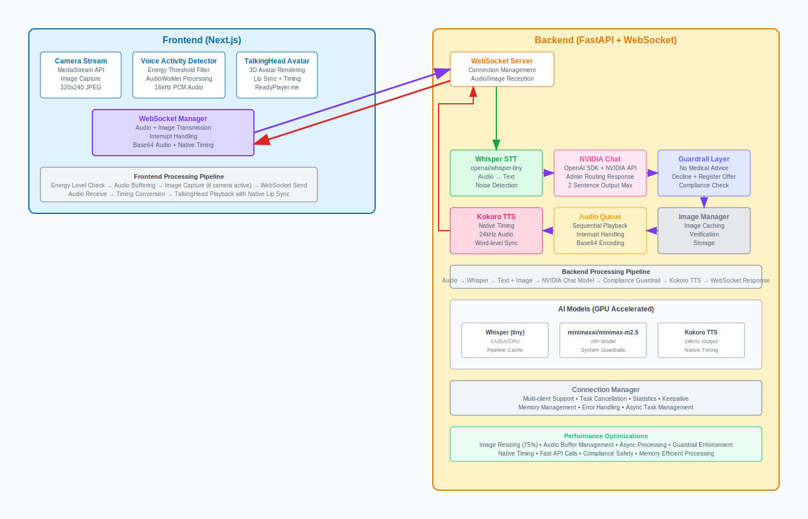

# 🎭 FrontDesk Nexus AI

**Real-time Voice-Controlled 3D Front Desk Assistant with Compliance Guardrails**

> Voice-first intake and department routing with a multimodal 3D assistant.

> Built for healthcare front desk workflows with strict no-medical-advice guardrails.

[](https://python.org)
[](https://fastapi.tiangolo.com)
[](https://nextjs.org)
[](https://developer.nvidia.com/cuda-toolkit)
[](LICENSE)


## 🎥 Demo Video

[](https://www.youtube.com/watch?v=dE_8TXmp2Sk)

## ✨ Features

### 🎯 **Core Capabilities**
- **🎤 Real-time Voice Activity Detection** - Advanced VAD with configurable sensitivity
- **🗣️ Speech-to-Text** - Powered by OpenAI Whisper (tiny model) for instant transcription
- **🧠 Administrative Routing Brain** - NVIDIA-hosted chat model for compliant text generation
- **🔊 Natural Text-to-Speech** - Kokoro TTS with native word-level timing
- **🎭 3D Avatar Animation** - Lip-sync and emotion-driven animations using [TalkingHead](https://github.com/met4citizen/TalkingHead)

### 🚀 **Advanced Features**
- **📹 Camera Integration** - Real-time image capture with voice commands
- **⚡ Streaming Responses** - Chunked audio generation for minimal latency
- **🎬 Native Timing Sync** - Perfect lip-sync using Kokoro's native timing data
- **🎨 Draggable Camera View** - Floating, resizable camera interface
- **📊 Real-time Analytics** - Voice energy visualization and transmission tracking
- **🔄 WebSocket Communication** - Low-latency bidirectional data flow

## 🏗️ Architecture



## 🛠️ Technology Stack

### Backend (Python)
- **🧠 AI Processing Stack:**
  - `openai/whisper-tiny` - Speech recognition
  - `minimaxai/minimax-m2.5` via NVIDIA OpenAI-compatible endpoint - Administrative routing responses
  - `Kokoro TTS` - High-quality voice synthesis
- **⚡ Framework:** FastAPI with WebSocket support
- **🔧 Processing:** PyTorch, Transformers, OpenAI Python SDK
- **🎵 Audio:** SoundFile, NumPy for real-time processing

### Frontend (TypeScript/React)
- **🖼️ Framework:** Next.js 15 with TypeScript
- **🎨 UI:** Tailwind CSS + shadcn/ui components
- **🎭 3D Rendering:** [TalkingHead](https://github.com/met4citizen/TalkingHead) library
- **🎙️ Audio:** Web Audio API with AudioWorklet
- **📡 Communication:** Native WebSocket with React Context

### 🔧 **Development Tools**
- **📦 Package Management:** UV (Python) + PNPM (Node.js)
- **🎨 Code Formatting:** 
  - **Backend:** Black (Python)
  - **Frontend:** Prettier (TypeScript/React)
- **🔍 Quality Control:** Husky for pre-commit hooks

## 📋 Requirements

### System Tested on
- **OS:** Windows 11 (Linux/macOS support coming soon, will create a docker image)
- **GPU:** NVIDIA RTX 3070 (8GB VRAM)

## 🚀 Quick Start

### 1. Prerequisites
- Node.js 20+
- PNPM
- Python 3.10
- UV (Python package manager)


### 2. **Setup monorepo dependencies from root**
```bash
# will setup both frontend and backend but require the prerequisites
pnpm run monorepo-setup
```

### 3. **Development Workflow**
```bash
# Format code before committing (recommended)
pnpm format
```

### 4. Run the Application

 **Start Development Servers**
```bash
# Run both frontend and backend from root
pnpm dev

# Or run individually
pnpm dev:client  # Frontend (http://localhost:3000)
pnpm dev:server  # Backend (http://localhost:8000)
```

### Environment Configuration


Example:

```powershell
$env:NVIDIA_API_KEY="your_nvidia_api_key_here"
$env:NVIDIA_MODEL="minimaxai/minimax-m2.5"
$env:NEXT_PUBLIC_WS_URL="wss://<your-ngrok-domain>/ws/test-client"
```

### 5. Initial Setup
1. **Allow microphone access** when prompted
2. **Enable camera** for multimodal interactions
3. **Click "Connect"** to establish WebSocket connection
4. **Tap "Start Session" or hold "Hold to Speak"** and begin speaking

### Compliance Guardrail
- The assistant acts only as an administrative intake assistant.
- It does **not** provide diagnosis, treatment, medication, or dosage advice.
- If users request medical advice, it declines and offers to register them for a doctor.

## 🎮 Usage Guide

### Camera Controls
- **Drag** to move camera window
- **Resize** with maximize/minimize buttons
- **Toggle on/off** as needed

### Voice Settings
- **Energy Threshold:** Adjust sensitivity to background noise
- **Pause Duration:** How long to wait before processing speech
- **Min/Max Speech:** Control segment length limits


## 🙏 Acknowledgments

- **TalkingHead** ([met4citizen](https://github.com/met4citizen/TalkingHead)) for 3D avatar rendering and lip-sync
- **yeyu2** ([Multimodal-local-phi4](https://github.com/yeyu2/Youtube_demos/tree/main/Multimodal-local-phi4)) for multimodal implementation inspiration


---

<div align="center">

**⭐ Star this repo if you find it useful! ⭐**

Made with ❤️ by the Kiranbaby14

</div>
